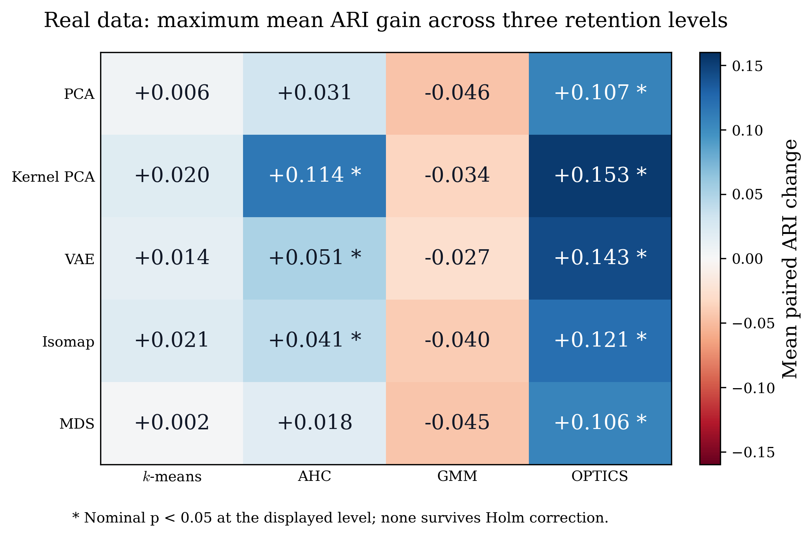

# How much can clustering performance be improved by using dimensionality reduction?

Code and frozen results for the paper's comparison of five dimensionality reduction methods and four clustering algorithms. The benchmark contains 20 real-world datasets and 1,165 synthetic datasets. Each reduced representation is compared with the same clusterer's no-reduction baseline.


**Project home:** [ELounissi/Dimensionality_Reduction_Clustering](https://github.com/ELounissi/Dimensionality_Reduction_Clustering)

Welcome! This project explores a practical question: when does a smaller feature space help clustering, and which combinations work well together?

### Choose your starting point

| I want to... | Start here |
| --- | --- |
| Explore the methods and see examples | [Guided notebook](benchmark.ipynb) |
| Read the paper's results | [Tables and figures](results/README.md) |
| Rebuild the published outputs | `python run_benchmark.py --from-frozen` |
| Run the complete benchmark | `python run_benchmark.py` |



This view summarizes the largest mean real-data ARI change over the three dimension rules for each reducer and clusterer. The [results guide](results/README.md) explains the signs, significance markers, and full comparisons.

### The workflow at a glance

1. **Meet the data:** explore dataset sizes, feature counts, and cluster counts.
2. **Build representations:** compare the original features with five reduction methods.
3. **Find clusters:** apply four clustering approaches to each representation.
4. **Compare results:** inspect ARI, paired gains, and statistical tests across datasets.

## Run the code

Use Python 3.12. Download this repository or clone it:

```bash
git clone https://github.com/ELounissi/Dimensionality_Reduction_Clustering.git
cd Dimensionality_Reduction_Clustering
```

From the repository folder, create an environment and install the pinned dependencies:

```bash
python -m venv .venv
```

Activate it with `.venv\Scripts\activate` on Windows or `source .venv/bin/activate` on Linux and macOS, then run:

```bash
python -m pip install -r requirements.txt
python run_benchmark.py
```

`run_benchmark.py` downloads the archived datasets, validates them, fits all benchmark conditions, and generates all numerical tables and figures. It uses four worker processes by default. The data archives require about 1.6 GB of downloads plus space for extraction. Install **7-Zip, unrar, or bsdtar** and make its executable available on `PATH` before downloading the RAR archives. Full fitting is computationally demanding, particularly Isomap, MDS, and OPTICS on the larger datasets. The VAE runs on CPU.

```bash
python run_benchmark.py --workers 8
python run_benchmark.py --data-dir /path/to/data --output runs/full
```

The default full-run output is `runs/full/`. It contains each dataset's candidate scores, representation metadata, reported ARI records, and a run manifest. Completed datasets are reused when the same command is resumed with unchanged code, data, and dependencies. Failed or incomplete datasets are not treated as completed results.

To reproduce the paper outputs immediately from the bundled records, without downloading data or fitting models:

```bash
python run_benchmark.py --from-frozen
```

This verifies the archive and writes `results/`, including a readable [results report](results/README.md), full-precision CSV tables, LaTeX table bodies, and PDF/PNG figures. The repository already includes these outputs.

To check every reported fit against the recorded candidate scores and verify all A9-A12 p-values:

```bash
python run_benchmark.py --verify
```

## Follow the notebook

Open [benchmark.ipynb](benchmark.ipynb) with Jupyter:

```bash
python -m notebook benchmark.ipynb
```

The notebook explains the data, preprocessing, dimension rules, clustering settings, aggregation, ARI results, and Wilcoxon calculations in sequence. Running all cells verifies the bundled records and rebuilds the paper outputs. It includes dataset-size charts, a visual Iris example, and an executable full-benchmark cell. Set `RUN_FULL_BENCHMARK = True` in that cell to download the source data and run the same `run_benchmark.py` entry point. By default, the notebook explores the bundled results first.

Both entry points call the same modules in `benchmark/`. The notebook does not contain a separate implementation of the methods or statistics.

## Data and sources

| Dataset group | Datasets | Configurations | Source |
| --- | ---: | ---: | --- |
| Real-world benchmarks | 20 | 20 datasets | [Figshare archive](https://doi.org/10.6084/m9.figshare.31386421.v1), with SPECTF from [UCI](https://doi.org/10.24432/C5N015) |
| Circles | 300 | 6 | [Figshare archive](https://doi.org/10.6084/m9.figshare.31387645.v1) |
| Moons | 300 | 6 | [Figshare archive](https://doi.org/10.6084/m9.figshare.31387609.v1) |
| Repliclust | 300 | 6 | [Figshare archive](https://doi.org/10.6084/m9.figshare.31387732.v1) |
| Rodriguez Structured Gaussian (RSG) | 265 | 27 | [Figshare archive](https://doi.org/10.6084/m9.figshare.31383301.v1) |

The benchmark reads the archived datasets; it does not generate replacements. Circles, Moons, and Repliclust have 2 or 5 clusters, 10, 50, or 200 features, and 50 datasets per configuration. Circles and Moons contain 2,000 objects per dataset. RSG combines 2, 10, or 50 clusters; 10, 50, or 200 features; and 5, 50, or 100 objects per cluster. Its archive contains 265 datasets across the 27 configurations.

Circles and Moons were embedded by Gaussian random projection and contain structured Gaussian noise on three quarters of the features, with standard deviations 1, 0.5, and 0.25. Five-ring Circles use one quarter of those noise amplitudes; two-ring Circles use factor 0.2. Repliclust and RSG contain no additional injected noise. The versioned dataset archives contain the inputs used by this benchmark. Their download locations and checksums are included in this repository.

The real datasets are Breast tissue, Breast Wisconsin, Ecoli, Glass, Haberman, Ionosphere, Iris, Movement libras, Musk, Parkinsons, Segmentation, Sonar all, SPECTF, Transfusion, Vehicle, Vertebral column, Vowel context, Wine, Wine quality red, and Yeast. [Table 1](results/tables/table_1.csv) gives their dimensions, object counts, and observed class counts. Glass has six observed classes. SPECTF uses the 44-feature, 267-object UCI dataset. The loader joins its training and test files because this study evaluates clustering of the whole dataset. For RSG ARFF files, the numeric `@data` block is read directly. Identifiers and class columns are excluded from the feature matrix.

`assets/sources.json` contains the archive versions, file URLs, licenses, and source MD5 checksums. Downloads are checked against those MD5 values. `assets/data_checksums.json` contains the recorded SHA-256 checksums for the real and RSG input files. Acquisition also writes a local `data/source_manifest.json`. Raw input data are downloaded from their sources and are not bundled in this repository; the frozen fit records and every paper output are bundled and can be used offline.

## Meet the methods

Clustering groups objects with similar features. Dimensionality reduction changes the feature space before those groups are found. Different combinations can reveal different kinds of structure.

| Clustering approach | Intuition |
| --- | --- |
| k-means | Finds compact groups around centroids |
| AHC | Builds a hierarchy by repeatedly merging groups |
| GMM | Represents groups as Gaussian distributions and models their shapes |
| OPTICS | Uses local density and reachability to identify groups |

| Reduction method | Intuition |
| --- | --- |
| PCA | Finds linear directions that explain variation |
| Kernel PCA | Uses a kernel to represent nonlinear relationships |
| VAE | Learns a compact probabilistic representation with a neural network |
| Isomap | Preserves distances along a neighborhood graph |
| MDS | Places objects so their pairwise distances are preserved as closely as possible |

The [notebook](benchmark.ipynb) connects these ideas to a small visual example before walking through the full benchmark results.

## Benchmark definition

Every feature is z-score normalized before clustering or dimensionality reduction. The observed number of classes, k, is supplied as the cluster-count target. Class assignments are used to calculate ARI, not to rank the clustering settings within a representation. This is a benchmark with known k.

The three target dimension rules are `max(k-1, 2)`, `ceil(0.25*d)`, and `ceil(0.50*d)`. Each target is capped at `min(d-1, n-1)`, where d is the feature count and n the object count. The percentage rules have a minimum of one dimension. No reduction plus five reducers at three levels gives 16 conditions per clusterer.

| Reducer | Implementation |
| --- | --- |
| PCA | Full SVD, with covariance eigendecomposition if SVD fails to converge |
| Kernel PCA | RBF kernel, gamma = 1/d, ARPACK eigensolver |
| VAE | Encoder widths 64 and 32, mirrored decoder, ReLU, batch normalization and dropout 0.4 after each stack; hidden widths are at least the latent width; posterior means are used for clustering |
| Isomap | Starts with 5 neighbors, doubling until the neighbor graph is connected; positive eigen-directions of the geodesic Gram matrix are retained and missing dimensions are zero-padded |
| MDS | Metric SMACOF with PCA initialization, one start, at most 300 iterations, tolerance 1e-6 |

The VAE uses Adam with learning rate 0.001, batches of 64, and 100 epochs. Its loss is summed reconstruction squared error per object plus the KL divergence with weight 1. Gradients are clipped at norm 10. Batches with fewer than two objects are skipped. Clustering uses the final model's posterior mean.

| Clusterer | Settings and internal criterion |
| --- | --- |
| k-means | k-means++ initialization, 100 starts, at most 300 iterations |
| AHC | Ward, complete, average, and single linkage with Euclidean, Manhattan, or cosine distance; Ward uses Euclidean only; the largest Euclidean silhouette determines the reported partition |
| GMM | Full, tied, diagonal, and spherical covariance; 10 initializations, at most 300 iterations, covariance regularization 1e-5; the lowest BIC determines the reported partition |
| OPTICS | min_samples = 5, 6, 7, 8, 9, 10; xi = 0.05; minimum cluster-size fractions 0.05 to 0.95 in steps of 0.05, with a floor of 5 objects and a size below n |

OPTICS first minimizes the difference between the extracted cluster count and k, then the noise fraction. Its numeric criterion is `-(1000*abs(found-k) + noise_fraction)`. Noise objects are subsequently assigned to the closest cluster centroid; if all objects are noise, they form one cluster. Reachability is computed once per min_samples value and reused for the xi extractions. Equal internal scores are resolved by lexical setting name. The same clustering procedure applies to the reduced and unreduced data.

Real datasets use seeds 11, 29, 47, 71, 101, 131, 173, 211, 257, and 307. These repeats are averaged within each dataset. A synthetic dataset uses the seed obtained from the first four SHA-256 bytes of its identifier, interpreted little-endian and reduced modulo 2^32-1. Deterministic reducers are fitted once per dataset and dimension rule. The VAE is refitted for each algorithm seed. CPU linear algebra uses one thread per worker.

## Tables, figures, and statistical units

| Paper item | Output and calculation |
| --- | --- |
| Table 1 | `results/tables/table_1.csv`: real dataset characteristics |
| Tables 2-5 | Win percentages and mean paired ARI changes for each clusterer; synthetic datasets receive equal weight |
| Tables A1-A4 | Mean ARI ± sample standard deviation across datasets within each synthetic family |
| Tables A5-A8 | Per-dataset real ARI, averaged over ten algorithm seeds |
| Table A9 | Two-sided Wilcoxon signed-rank tests on 45 synthetic configuration means |
| Table A10 | One-sided Wilcoxon tests of improvement on 20 real dataset means |
| Table A11 | Two-sided real-data reducer comparisons, averaging the three levels and four clusterers; no reduction averages its four baselines once |
| Table A12 | Two-sided real-data clusterer comparisons, averaging all 16 conditions |
| Figure 1 | Bundled synthetic-data illustration in `assets/figure_1.pdf`, copied unchanged |
| Figure 2 | Evaluation diagram; the inset averages the four synthetic families' maximum mean ARI for each reducer across clusterers and levels |
| Figures 3-6 | Synthetic ARI boxplots over 45 configuration means |
| Figures 7-10 | Real ARI boxplots over 20 dataset means |
| Figure A.1 | `figure_11.pdf`: maximum mean paired real ARI change over the three levels, one cell per reducer and clusterer |

Synthetic configurations are defined by family, cluster count, feature count, and object count. Averaging replicates first gives each of the 45 configurations equal weight in A9 and Figures 3-6. This differs from the equal-dataset weighting in Tables 2-5 and A1-A4. Standard deviations describe variation across datasets, not standard errors or confidence intervals.

All Wilcoxon tests use Pratt handling of zero differences and SciPy's `method="auto"`. A9 and A10 signs indicate the direction of the mean paired ARI change; p-values themselves are nonnegative. A11 and A12 display the lower triangle with signs for row minus column. Bold marks nominal p < 0.05. The manuscript displays p-values below 0.001 as 0.001; the CSV files retain their actual values. Holm-adjusted values are also supplied: 60 comparisons per baseline table, 15 reducer comparisons, and 6 clusterer comparisons. Algorithm seeds are not treated as independent datasets.

The heatmap takes the maximum of three mean gains. It does not take a different maximizing level on each dataset. Its stars refer to the nominal fixed-condition tests at the displayed level. The maxima summarize the observed results; they do not establish that the maximizing method is significantly better than every alternative. These benchmark comparisons should be read with their effect sizes and adjusted p-values.

## Main results

| Real-data clusterer | No-DR mean ARI | Largest reduced mean ARI | Reducer and level | Mean change | Raw p |
| --- | ---: | ---: | --- | ---: | ---: |
| k-means | 0.2305 | 0.2513 | Isomap, k-1 | +0.0208 | 0.155897 |
| AHC | 0.1368 | 0.2507 | Kernel PCA, k-1 | +0.1140 | 0.002790 |
| GMM | 0.2793 | 0.2520 | VAE, 50% | -0.0273 | 0.662889 |
| OPTICS | 0.0970 | 0.2497 | Kernel PCA, k-1 | +0.1527 | 0.003774 |

AHC and OPTICS show the largest real-data gains. GMM has its highest mean ARI without reduction. k-means has positive mean gains under several reduced conditions, without nominal significance in A10. There are 17 nominally significant real comparisons and none after Holm correction across the 60 tests. Among the synthetic comparisons, 25 are nominally significant and four survive Holm correction, including improvements and a decrease. [The full results report](results/README.md) includes every ARI and statistical table, the synthetic summaries, and all figures.

## Files and reproducibility

- `run_benchmark.py`: complete fitting run, frozen-result rebuild, and verification commands.
- `benchmark.ipynb`: executable explanation of the same workflow.
- `benchmark/`: dataset loaders, fixed method implementations, benchmark engine, statistics, plots, and checks.
- `frozen/raw_results.csv.gz`: 87,360 reported dataset/seed/representation/clusterer records.
- `frozen/candidates.csv.gz`: 2,805,840 recorded fits from the paper's clustering grid.
- `frozen/representations.csv.gz`: 21,840 representation records, including actual dimensions and fitting metadata.
- `frozen/statistics_reference.json`: reference p-values for A9-A12.
- `frozen/checksums.json`: SHA-256 hashes of the bundled records and assets.
- `assets/`: source metadata, input checksums, and the Figure 1 illustration.
- `results/`: all generated paper outputs and their readable report.

The frozen records preserve the numerical values used to build the paper outputs. The benchmark implementation uses the same method settings and operation order. A new model-fitting run can have small numerical differences across operating systems, BLAS libraries, or hardware. The pinned environment and fixed seeds reduce this variation; the bundled records provide the exact reference for the reported results. Figure 1 is a supplied illustration rather than a newly fitted benchmark output.

The code is distributed under the included MIT license. Dataset archive licenses and citations are recorded with their sources; cite the underlying datasets as well as the paper when using them.
