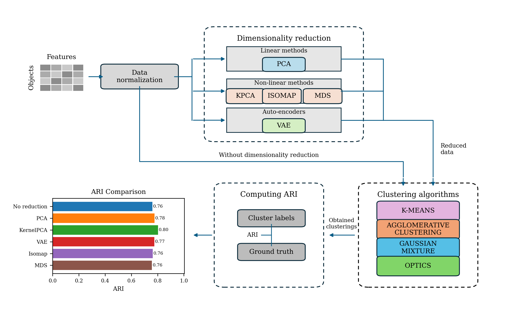
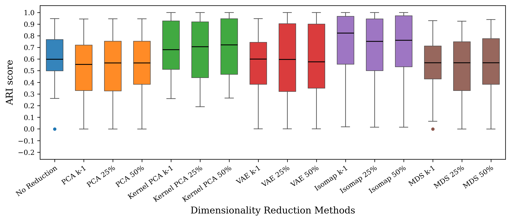
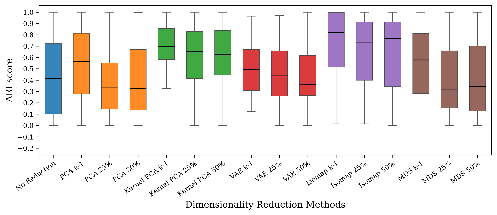
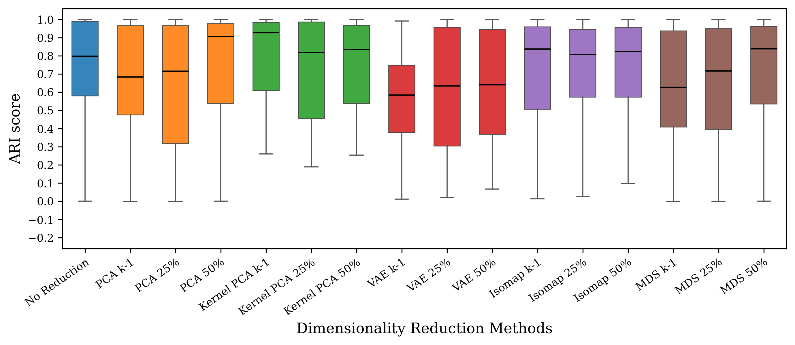
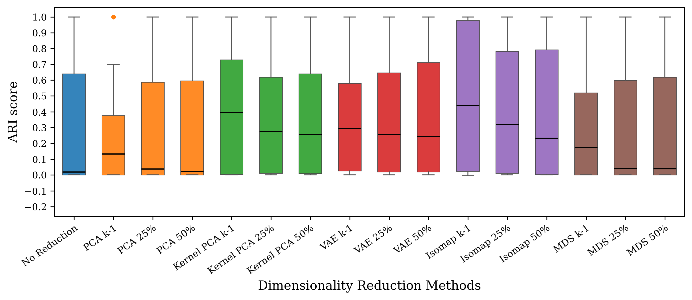
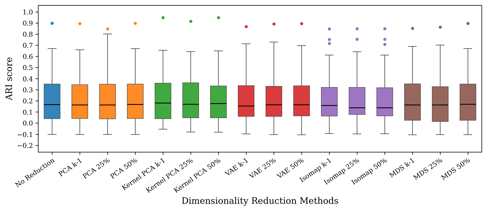
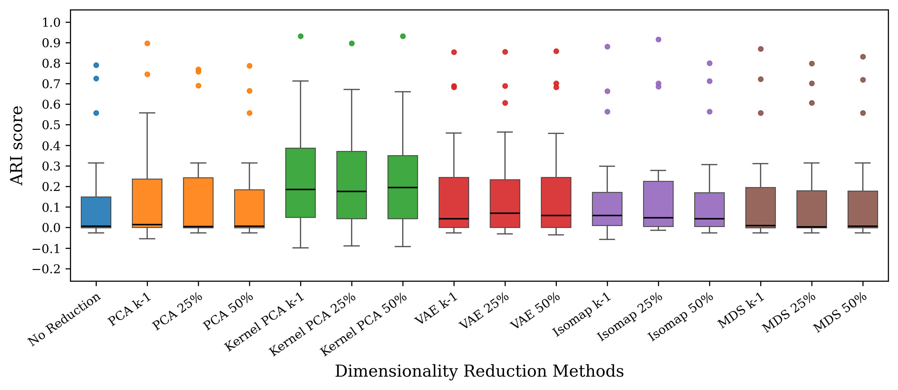
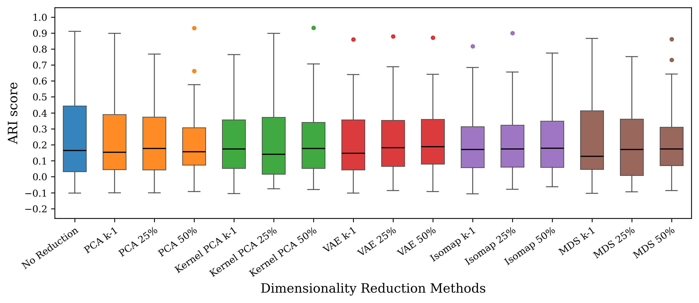
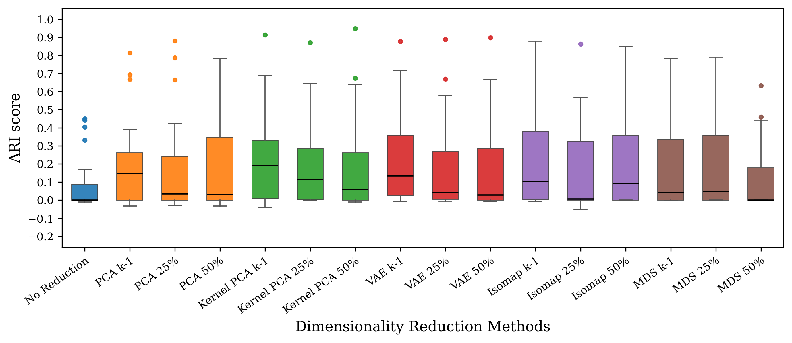

# Paper results

[Project home](https://github.com/ELounissi/Dimensionality_Reduction_Clustering) | [Guided notebook](../benchmark.ipynb)

All CSV files retain full precision. The tables below use the manuscript's display precision. Bold indicates a row maximum in ARI tables or nominal p < 0.05 in statistical tables.

## Real: largest mean ARI among the reduced conditions

Each entry reports one fixed reducer and dimension rule across all units. These maxima are descriptive summaries; the tables report every condition.

| Clusterer | No DR | Reducer | Dimension | Reduced ARI | Change | Raw p | Holm p |
| --- | --- | --- | --- | --- | --- | --- | --- |
| k-means | 0.2305 | Isomap | k-1 | 0.2513 | +0.0208 | 0.155897 | 1 |
| AHC | 0.1368 | Kernel PCA | k-1 | 0.2507 | +0.1140 | 0.00279045 | 0.167427 |
| GMM | 0.2793 | VAE | 50% | 0.2520 | -0.0273 | 0.662889 | 1 |
| OPTICS | 0.0970 | Kernel PCA | k-1 | 0.2497 | +0.1527 | 0.00377437 | 0.222688 |

## Synthetic: largest mean ARI among the reduced conditions

Each entry reports one fixed reducer and dimension rule across all units. These maxima are descriptive summaries; the tables report every condition.

| Clusterer | No DR | Reducer | Dimension | Reduced ARI | Change | Raw p | Holm p |
| --- | --- | --- | --- | --- | --- | --- | --- |
| k-means | 0.5900 | Isomap | k-1 | 0.7030 | +0.1131 | 0.0067475 | 0.337375 |
| AHC | 0.4378 | Isomap | k-1 | 0.7052 | +0.2673 | 0.000100852 | 0.00595029 |
| GMM | 0.7070 | Kernel PCA | k-1 | 0.7684 | +0.0613 | 0.229563 | 1 |
| OPTICS | 0.2859 | Isomap | k-1 | 0.4759 | +0.1900 | 1.76597e-07 | 1.05958e-05 |

## Table 1: Real-world datasets

| Dataset | Objects | Features | Clusters |
| --- | --- | --- | --- |
| Breast tissue | 106 | 9 | 6 |
| Breast Wisconsin | 569 | 30 | 2 |
| Ecoli | 336 | 7 | 8 |
| Glass | 214 | 9 | 6 |
| Haberman | 306 | 3 | 2 |
| Ionosphere | 351 | 34 | 2 |
| Iris | 150 | 4 | 3 |
| Movement libras | 360 | 90 | 15 |
| Musk | 476 | 166 | 2 |
| Parkinsons | 195 | 22 | 2 |
| Segmentation | 2310 | 19 | 7 |
| Sonar all | 208 | 60 | 2 |
| Spectf | 267 | 44 | 2 |
| Transfusion | 748 | 4 | 2 |
| Vehicle | 846 | 18 | 4 |
| Vertebral column | 310 | 6 | 3 |
| Vowel context | 990 | 10 | 11 |
| Wine | 178 | 13 | 3 |
| Wine quality red | 1599 | 11 | 6 |
| Yeast | 1484 | 8 | 10 |

## Table 2: k-means improvements

Wins are percentages of datasets. Average changes are 100 times the absolute ARI difference, in percentage points. Ties remain in the denominator.

| Condition | Synthetic wins (%) | Real wins (%) | Synthetic change (pp) | Real change (pp) |
| --- | --- | --- | --- | --- |
| PCA k-1 | 26.2 | 25.0 | -2.29 | -0.02 |
| PCA 25% | 19.7 | 20.0 | -2.63 | +0.56 |
| PCA 50% | 18.2 | 35.0 | -1.07 | -0.06 |
| Kernel PCA k-1 | 69.8 | 60.0 | +15.14 | +1.95 |
| Kernel PCA 25% | 67.9 | 50.0 | +14.45 | +0.84 |
| Kernel PCA 50% | 73.5 | 60.0 | +16.68 | +1.34 |
| VAE k-1 | 47.6 | 50.0 | -0.66 | +1.18 |
| VAE 25% | 49.1 | 55.0 | +0.92 | +1.44 |
| VAE 50% | 48.9 | 50.0 | +1.14 | +1.17 |
| Isomap k-1 | 52.2 | 65.0 | +1.04 | +2.08 |
| Isomap 25% | 47.8 | 55.0 | +0.02 | +0.49 |
| Isomap 50% | 50.4 | 60.0 | +0.82 | +1.90 |
| MDS k-1 | 28.8 | 35.0 | -10.07 | -0.32 |
| MDS 25% | 20.6 | 50.0 | -3.37 | -0.35 |
| MDS 50% | 20.4 | 35.0 | -1.14 | +0.17 |

## Table 3: AHC improvements

Wins are percentages of datasets. Average changes are 100 times the absolute ARI difference, in percentage points. Ties remain in the denominator.

| Condition | Synthetic wins (%) | Real wins (%) | Synthetic change (pp) | Real change (pp) |
| --- | --- | --- | --- | --- |
| PCA k-1 | 53.8 | 50.0 | +19.18 | +3.12 |
| PCA 25% | 32.8 | 30.0 | +0.33 | +2.27 |
| PCA 50% | 31.6 | 20.0 | +0.11 | +0.88 |
| Kernel PCA k-1 | 75.3 | 80.0 | +36.32 | +11.40 |
| Kernel PCA 25% | 66.8 | 70.0 | +30.35 | +10.70 |
| Kernel PCA 50% | 68.1 | 70.0 | +30.79 | +11.34 |
| VAE k-1 | 48.1 | 60.0 | +13.89 | +4.91 |
| VAE 25% | 44.3 | 60.0 | +9.84 | +4.66 |
| VAE 50% | 41.2 | 70.0 | +7.82 | +5.06 |
| Isomap k-1 | 55.3 | 60.0 | +21.17 | +2.72 |
| Isomap 25% | 48.7 | 60.0 | +18.48 | +4.05 |
| Isomap 50% | 49.5 | 50.0 | +18.12 | +2.31 |
| MDS k-1 | 53.0 | 35.0 | +10.17 | +1.76 |
| MDS 25% | 31.9 | 30.0 | -0.09 | +0.50 |
| MDS 50% | 32.2 | 30.0 | +0.19 | +0.75 |

## Table 4: GMM improvements

Wins are percentages of datasets. Average changes are 100 times the absolute ARI difference, in percentage points. Ties remain in the denominator.

| Condition | Synthetic wins (%) | Real wins (%) | Synthetic change (pp) | Real change (pp) |
| --- | --- | --- | --- | --- |
| PCA k-1 | 36.1 | 60.0 | -0.33 | -4.56 |
| PCA 25% | 31.1 | 45.0 | -2.26 | -4.95 |
| PCA 50% | 31.2 | 65.0 | -0.70 | -4.87 |
| Kernel PCA k-1 | 47.0 | 40.0 | +12.26 | -4.31 |
| Kernel PCA 25% | 48.4 | 40.0 | +12.47 | -5.61 |
| Kernel PCA 50% | 47.1 | 45.0 | +13.28 | -3.38 |
| VAE k-1 | 41.1 | 45.0 | -4.55 | -5.06 |
| VAE 25% | 36.5 | 45.0 | -2.54 | -2.91 |
| VAE 50% | 41.5 | 50.0 | -0.98 | -2.73 |
| Isomap k-1 | 50.6 | 35.0 | -0.24 | -4.70 |
| Isomap 25% | 48.6 | 45.0 | +3.37 | -4.01 |
| Isomap 50% | 52.9 | 50.0 | +6.54 | -4.14 |
| MDS k-1 | 24.1 | 40.0 | -9.43 | -4.46 |
| MDS 25% | 28.5 | 55.0 | -2.39 | -4.68 |
| MDS 50% | 31.7 | 45.0 | -1.57 | -4.56 |

## Table 5: OPTICS improvements

Wins are percentages of datasets. Average changes are 100 times the absolute ARI difference, in percentage points. Ties remain in the denominator.

| Condition | Synthetic wins (%) | Real wins (%) | Synthetic change (pp) | Real change (pp) |
| --- | --- | --- | --- | --- |
| PCA k-1 | 31.0 | 55.0 | +9.41 | +10.66 |
| PCA 25% | 7.6 | 40.0 | -0.48 | +9.58 |
| PCA 50% | 5.8 | 35.0 | -0.81 | +9.69 |
| Kernel PCA k-1 | 53.8 | 75.0 | +26.59 | +15.27 |
| Kernel PCA 25% | 44.4 | 70.0 | +19.51 | +10.71 |
| Kernel PCA 50% | 34.8 | 55.0 | +15.26 | +10.42 |
| VAE k-1 | 43.4 | 70.0 | +20.48 | +14.28 |
| VAE 25% | 40.4 | 70.0 | +18.97 | +9.34 |
| VAE 50% | 40.0 | 45.0 | +18.11 | +8.65 |
| Isomap k-1 | 49.7 | 60.0 | +23.44 | +12.10 |
| Isomap 25% | 44.4 | 45.0 | +15.52 | +6.44 |
| Isomap 50% | 39.0 | 55.0 | +12.15 | +9.54 |
| MDS k-1 | 34.2 | 35.0 | +14.17 | +9.45 |
| MDS 25% | 7.0 | 45.0 | -1.08 | +10.61 |
| MDS 50% | 6.1 | 25.0 | -0.45 | +2.82 |

## Table A1: Circles ARI

Mean ± sample standard deviation across datasets.

| Clusterer | No reduction | PCA k-1 | PCA 25% | PCA 50% | Kernel PCA k-1 | Kernel PCA 25% | Kernel PCA 50% | VAE k-1 | VAE 25% | VAE 50% | Isomap k-1 | Isomap 25% | Isomap 50% | MDS k-1 | MDS 25% | MDS 50% |
| --- | --- | --- | --- | --- | --- | --- | --- | --- | --- | --- | --- | --- | --- | --- | --- | --- |
| k-means | 0.158 ± 0.163 | 0.158 ± 0.163 | 0.157 ± 0.163 | 0.158 ± 0.163 | 0.581 ± 0.378 | 0.590 ± 0.374 | **0.622 ± 0.358** | 0.161 ± 0.155 | 0.181 ± 0.147 | 0.160 ± 0.156 | 0.280 ± 0.286 | 0.301 ± 0.299 | 0.304 ± 0.299 | 0.157 ± 0.163 | 0.156 ± 0.163 | 0.157 ± 0.163 |
| AHC | 0.215 ± 0.079 | 0.212 ± 0.084 | 0.211 ± 0.083 | 0.218 ± 0.091 | **0.639 ± 0.329** | 0.633 ± 0.327 | 0.637 ± 0.344 | 0.212 ± 0.088 | 0.225 ± 0.081 | 0.218 ± 0.079 | 0.270 ± 0.286 | 0.290 ± 0.288 | 0.272 ± 0.292 | 0.212 ± 0.083 | 0.209 ± 0.081 | 0.216 ± 0.088 |
| GMM | 0.049 ± 0.058 | 0.155 ± 0.156 | 0.153 ± 0.153 | 0.121 ± 0.140 | 0.572 ± 0.382 | 0.594 ± 0.370 | **0.626 ± 0.352** | 0.138 ± 0.132 | 0.179 ± 0.159 | 0.181 ± 0.136 | 0.323 ± 0.355 | 0.512 ± 0.412 | 0.516 ± 0.366 | 0.154 ± 0.156 | 0.152 ± 0.153 | 0.120 ± 0.139 |
| OPTICS | 0.631 ± 0.352 | 0.697 ± 0.303 | 0.609 ± 0.363 | 0.605 ± 0.359 | 0.767 ± 0.245 | 0.758 ± 0.273 | **0.771 ± 0.265** | 0.723 ± 0.292 | 0.727 ± 0.289 | 0.720 ± 0.295 | 0.724 ± 0.291 | 0.741 ± 0.287 | 0.744 ± 0.270 | 0.654 ± 0.328 | 0.597 ± 0.367 | 0.611 ± 0.357 |

## Table A2: Moons ARI

Mean ± sample standard deviation across datasets.

| Clusterer | No reduction | PCA k-1 | PCA 25% | PCA 50% | Kernel PCA k-1 | Kernel PCA 25% | Kernel PCA 50% | VAE k-1 | VAE 25% | VAE 50% | Isomap k-1 | Isomap 25% | Isomap 50% | MDS k-1 | MDS 25% | MDS 50% |
| --- | --- | --- | --- | --- | --- | --- | --- | --- | --- | --- | --- | --- | --- | --- | --- | --- |
| k-means | 0.541 ± 0.258 | 0.541 ± 0.258 | 0.539 ± 0.258 | 0.540 ± 0.258 | 0.603 ± 0.203 | 0.604 ± 0.197 | 0.610 ± 0.198 | 0.572 ± 0.200 | 0.577 ± 0.208 | 0.573 ± 0.213 | **0.742 ± 0.176** | 0.725 ± 0.196 | 0.725 ± 0.197 | 0.537 ± 0.269 | 0.543 ± 0.261 | 0.542 ± 0.259 |
| AHC | 0.585 ± 0.234 | 0.584 ± 0.224 | 0.582 ± 0.229 | 0.585 ± 0.225 | 0.617 ± 0.213 | 0.600 ± 0.225 | 0.590 ± 0.241 | 0.595 ± 0.190 | 0.590 ± 0.209 | 0.593 ± 0.200 | **0.808 ± 0.194** | 0.803 ± 0.215 | 0.796 ± 0.214 | 0.569 ± 0.228 | 0.581 ± 0.227 | 0.586 ± 0.229 |
| GMM | 0.627 ± 0.143 | 0.584 ± 0.114 | 0.511 ± 0.158 | 0.491 ± 0.172 | 0.566 ± 0.236 | 0.644 ± 0.208 | 0.600 ± 0.179 | 0.585 ± 0.152 | 0.579 ± 0.145 | 0.565 ± 0.133 | **0.876 ± 0.117** | 0.772 ± 0.229 | 0.791 ± 0.202 | 0.573 ± 0.123 | 0.511 ± 0.159 | 0.492 ± 0.174 |
| OPTICS | 0.163 ± 0.370 | 0.522 ± 0.411 | 0.210 ± 0.402 | 0.173 ± 0.379 | 0.433 ± 0.391 | 0.504 ± 0.401 | 0.444 ± 0.437 | 0.710 ± 0.341 | 0.706 ± 0.354 | 0.702 ± 0.347 | **0.718 ± 0.335** | 0.520 ± 0.373 | 0.460 ± 0.394 | 0.500 ± 0.414 | 0.177 ± 0.382 | 0.177 ± 0.382 |

## Table A3: RSG ARI

Mean ± sample standard deviation across datasets.

| Clusterer | No reduction | PCA k-1 | PCA 25% | PCA 50% | Kernel PCA k-1 | Kernel PCA 25% | Kernel PCA 50% | VAE k-1 | VAE 25% | VAE 50% | Isomap k-1 | Isomap 25% | Isomap 50% | MDS k-1 | MDS 25% | MDS 50% |
| --- | --- | --- | --- | --- | --- | --- | --- | --- | --- | --- | --- | --- | --- | --- | --- | --- |
| k-means | 0.625 ± 0.240 | 0.529 ± 0.249 | 0.527 ± 0.284 | 0.579 ± 0.261 | 0.658 ± 0.220 | 0.627 ± 0.283 | 0.671 ± 0.249 | 0.553 ± 0.280 | 0.583 ± 0.305 | 0.617 ± 0.309 | **0.848 ± 0.227** | 0.804 ± 0.252 | 0.832 ± 0.230 | 0.629 ± 0.246 | 0.558 ± 0.280 | 0.593 ± 0.253 |
| AHC | 0.523 ± 0.419 | 0.548 ± 0.364 | 0.391 ± 0.374 | 0.459 ± 0.389 | 0.674 ± 0.232 | 0.552 ± 0.337 | 0.608 ± 0.323 | 0.496 ± 0.320 | 0.436 ± 0.336 | 0.465 ± 0.353 | **0.840 ± 0.254** | 0.747 ± 0.320 | 0.777 ± 0.311 | 0.641 ± 0.352 | 0.438 ± 0.377 | 0.477 ± 0.396 |
| GMM | 0.810 ± 0.260 | 0.729 ± 0.310 | 0.730 ± 0.310 | **0.847 ± 0.221** | 0.810 ± 0.272 | 0.722 ± 0.317 | 0.762 ± 0.270 | 0.569 ± 0.306 | 0.616 ± 0.321 | 0.695 ± 0.304 | 0.778 ± 0.305 | 0.790 ± 0.261 | 0.825 ± 0.221 | 0.731 ± 0.330 | 0.712 ± 0.307 | 0.807 ± 0.215 |
| OPTICS | 0.298 ± 0.393 | 0.117 ± 0.200 | 0.247 ± 0.365 | 0.277 ± 0.381 | 0.231 ± 0.335 | 0.198 ± 0.324 | 0.225 ± 0.351 | 0.224 ± 0.327 | 0.269 ± 0.379 | 0.272 ± 0.387 | **0.435 ± 0.458** | 0.359 ± 0.432 | 0.318 ± 0.412 | 0.200 ± 0.294 | 0.264 ± 0.371 | 0.285 ± 0.386 |

## Table A4: Repliclust ARI

Mean ± sample standard deviation across datasets.

| Clusterer | No reduction | PCA k-1 | PCA 25% | PCA 50% | Kernel PCA k-1 | Kernel PCA 25% | Kernel PCA 50% | VAE k-1 | VAE 25% | VAE 50% | Isomap k-1 | Isomap 25% | Isomap 50% | MDS k-1 | MDS 25% | MDS 50% |
| --- | --- | --- | --- | --- | --- | --- | --- | --- | --- | --- | --- | --- | --- | --- | --- | --- |
| k-means | 0.912 ± 0.060 | 0.909 ± 0.055 | 0.899 ± 0.061 | 0.912 ± 0.055 | 0.986 ± 0.016 | 0.978 ± 0.038 | **0.986 ± 0.016** | 0.916 ± 0.055 | 0.926 ± 0.044 | 0.930 ± 0.042 | 0.433 ± 0.401 | 0.428 ± 0.399 | 0.431 ± 0.403 | 0.522 ± 0.320 | 0.840 ± 0.123 | 0.897 ± 0.072 |
| AHC | 0.162 ± 0.356 | 0.889 ± 0.208 | 0.299 ± 0.418 | 0.221 ± 0.395 | **0.983 ± 0.020** | 0.882 ± 0.226 | 0.856 ± 0.257 | 0.717 ± 0.403 | 0.607 ± 0.451 | 0.506 ± 0.472 | 0.426 ± 0.413 | 0.389 ± 0.420 | 0.374 ± 0.428 | 0.472 ± 0.370 | 0.244 ± 0.391 | 0.208 ± 0.387 |
| GMM | 0.974 ± 0.067 | 0.968 ± 0.019 | 0.969 ± 0.044 | 0.978 ± 0.042 | **0.987 ± 0.015** | 0.974 ± 0.043 | 0.981 ± 0.030 | 0.962 ± 0.018 | 0.964 ± 0.036 | 0.966 ± 0.029 | 0.469 ± 0.427 | 0.514 ± 0.371 | 0.583 ± 0.340 | 0.626 ± 0.389 | 0.980 ± 0.028 | 0.978 ± 0.050 |
| OPTICS | 0.002 ± 0.017 | 0.103 ± 0.253 | 0.004 ± 0.032 | 0.004 ± 0.027 | **0.688 ± 0.372** | 0.380 ± 0.440 | 0.238 ± 0.395 | 0.224 ± 0.326 | 0.126 ± 0.219 | 0.101 ± 0.190 | 0.143 ± 0.289 | 0.083 ± 0.210 | 0.046 ± 0.141 | 0.280 ± 0.422 | 0.010 ± 0.051 | 0.003 ± 0.019 |

## Table A5: k-means real-data ARI

Each cell is the mean of ten algorithm seeds.

| Dataset | No reduction | PCA k-1 | PCA 25% | PCA 50% | Kernel PCA k-1 | Kernel PCA 25% | Kernel PCA 50% | VAE k-1 | VAE 25% | VAE 50% | Isomap k-1 | Isomap 25% | Isomap 50% | MDS k-1 | MDS 25% | MDS 50% |
| --- | --- | --- | --- | --- | --- | --- | --- | --- | --- | --- | --- | --- | --- | --- | --- | --- |
| Breast tissue | 0.269 | 0.272 | 0.264 | 0.272 | 0.275 | **0.339** | 0.275 | 0.266 | 0.270 | 0.266 | 0.298 | 0.299 | 0.298 | 0.260 | 0.288 | 0.260 |
| Breast Wisconsin | 0.671 | 0.659 | 0.671 | 0.671 | 0.655 | 0.643 | 0.649 | 0.713 | 0.728 | 0.696 | 0.753 | **0.755** | **0.755** | 0.689 | 0.677 | 0.671 |
| Ecoli | 0.502 | 0.506 | 0.459 | 0.482 | 0.416 | 0.434 | 0.363 | 0.481 | 0.446 | 0.487 | **0.716** | 0.443 | 0.708 | 0.503 | 0.366 | 0.521 |
| Glass | 0.169 | 0.170 | **0.266** | 0.170 | 0.177 | 0.178 | 0.177 | 0.188 | 0.227 | 0.188 | 0.141 | 0.140 | 0.141 | 0.165 | 0.171 | 0.165 |
| Haberman | -0.001 | 0.013 | -0.003 | 0.013 | -0.007 | 0.001 | -0.007 | **0.053** | 0.035 | **0.053** | 0.014 | -0.014 | 0.014 | 0.008 | -0.002 | 0.008 |
| Ionosphere | 0.168 | 0.158 | 0.168 | 0.168 | 0.208 | **0.213** | **0.213** | 0.146 | 0.172 | 0.163 | 0.136 | 0.136 | 0.136 | 0.113 | 0.168 | 0.168 |
| Iris | 0.620 | 0.620 | **0.802** | 0.620 | 0.641 | 0.559 | 0.641 | 0.678 | 0.694 | 0.678 | 0.612 | 0.641 | 0.612 | 0.610 | 0.702 | 0.610 |
| Movement libras | 0.316 | 0.310 | 0.317 | 0.315 | **0.341** | 0.332 | 0.326 | 0.297 | 0.293 | 0.304 | 0.297 | 0.293 | 0.297 | 0.318 | 0.316 | 0.315 |
| Musk | 0.004 | 0.001 | 0.004 | 0.004 | 0.001 | -0.000 | -0.000 | -0.001 | 0.005 | 0.005 | **0.007** | **0.007** | **0.007** | -0.003 | 0.004 | 0.004 |
| Parkinsons | -0.098 | -0.098 | -0.098 | -0.098 | **0.161** | **0.161** | **0.161** | 0.063 | 0.077 | 0.069 | 0.094 | 0.094 | 0.094 | -0.074 | -0.091 | -0.098 |
| Segmentation | 0.461 | 0.452 | 0.453 | 0.463 | 0.508 | 0.461 | **0.514** | 0.461 | 0.450 | 0.431 | 0.392 | 0.394 | 0.382 | 0.461 | 0.465 | 0.463 |
| Sonar all | -0.002 | -0.002 | -0.002 | -0.002 | 0.019 | 0.016 | 0.016 | **0.025** | 0.006 | 0.006 | -0.005 | -0.004 | -0.004 | -0.004 | -0.002 | -0.001 |
| Spectf | -0.103 | -0.103 | -0.103 | -0.103 | **-0.054** | -0.079 | -0.082 | -0.097 | -0.103 | -0.105 | -0.094 | -0.097 | -0.096 | -0.105 | -0.103 | -0.103 |
| Transfusion | 0.053 | 0.051 | 0.049 | 0.051 | 0.013 | 0.003 | 0.013 | 0.031 | 0.037 | 0.031 | 0.062 | **0.068** | 0.062 | 0.032 | 0.020 | 0.032 |
| Vehicle | 0.076 | 0.076 | 0.076 | 0.075 | 0.075 | 0.074 | 0.072 | 0.077 | 0.076 | 0.075 | 0.089 | **0.096** | 0.094 | 0.080 | 0.077 | 0.076 |
| Vertebral column | 0.211 | 0.241 | 0.241 | 0.248 | 0.255 | 0.255 | 0.238 | 0.245 | 0.245 | 0.246 | 0.248 | 0.248 | **0.256** | 0.254 | 0.254 | 0.249 |
| Vowel context | 0.167 | 0.165 | 0.158 | 0.177 | 0.184 | 0.150 | 0.177 | 0.164 | 0.160 | 0.168 | 0.177 | 0.171 | **0.193** | 0.165 | 0.159 | 0.174 |
| Wine | 0.897 | 0.895 | 0.847 | 0.897 | 0.949 | 0.915 | **0.949** | 0.868 | 0.891 | 0.895 | 0.847 | 0.848 | 0.848 | 0.852 | 0.864 | 0.896 |
| Wine quality red | 0.062 | 0.057 | 0.059 | 0.058 | 0.047 | 0.059 | 0.059 | 0.068 | 0.068 | 0.069 | 0.065 | **0.081** | 0.067 | 0.059 | 0.070 | 0.060 |
| Yeast | 0.166 | 0.163 | 0.094 | 0.115 | 0.136 | 0.065 | 0.124 | 0.121 | 0.121 | 0.120 | **0.178** | 0.109 | 0.126 | 0.163 | 0.139 | 0.176 |

## Table A6: AHC real-data ARI

Each cell is the mean of ten algorithm seeds.

| Dataset | No reduction | PCA k-1 | PCA 25% | PCA 50% | Kernel PCA k-1 | Kernel PCA 25% | Kernel PCA 50% | VAE k-1 | VAE 25% | VAE 50% | Isomap k-1 | Isomap 25% | Isomap 50% | MDS k-1 | MDS 25% | MDS 50% |
| --- | --- | --- | --- | --- | --- | --- | --- | --- | --- | --- | --- | --- | --- | --- | --- | --- |
| Breast tissue | 0.156 | 0.156 | 0.280 | 0.156 | 0.267 | **0.345** | 0.267 | 0.223 | 0.213 | 0.223 | 0.158 | 0.241 | 0.158 | 0.265 | 0.274 | 0.265 |
| Breast Wisconsin | 0.005 | 0.002 | 0.005 | 0.005 | **0.713** | 0.672 | 0.660 | 0.002 | 0.000 | 0.000 | 0.005 | 0.005 | 0.005 | 0.005 | 0.005 | 0.005 |
| Ecoli | 0.726 | **0.746** | 0.691 | 0.665 | 0.430 | 0.501 | 0.517 | 0.689 | 0.607 | 0.701 | 0.664 | 0.686 | 0.713 | 0.722 | 0.607 | 0.719 |
| Glass | 0.021 | **0.256** | 0.017 | **0.256** | 0.200 | 0.206 | 0.200 | 0.186 | 0.178 | 0.186 | 0.066 | 0.066 | 0.066 | 0.023 | 0.009 | 0.023 |
| Haberman | **0.012** | **0.012** | 0.007 | **0.012** | -0.006 | -0.004 | -0.006 | 0.010 | 0.007 | 0.010 | **0.012** | **0.012** | **0.012** | **0.012** | 0.007 | **0.012** |
| Ionosphere | 0.004 | 0.096 | 0.004 | 0.004 | 0.192 | **0.288** | 0.264 | 0.057 | 0.099 | 0.075 | 0.132 | 0.004 | 0.004 | 0.173 | 0.004 | 0.004 |
| Iris | 0.558 | 0.558 | **0.758** | 0.558 | 0.641 | 0.549 | 0.641 | 0.682 | 0.688 | 0.682 | 0.564 | 0.702 | 0.564 | 0.558 | 0.702 | 0.558 |
| Movement libras | 0.314 | 0.299 | 0.314 | 0.314 | **0.372** | 0.322 | 0.329 | 0.309 | 0.292 | 0.305 | 0.299 | 0.278 | 0.306 | 0.312 | 0.314 | 0.314 |
| Musk | -0.002 | 0.003 | -0.002 | -0.002 | 0.002 | 0.004 | -0.002 | -0.002 | -0.003 | -0.002 | **0.008** | 0.003 | -0.002 | -0.002 | -0.002 | -0.002 |
| Parkinsons | -0.026 | -0.026 | -0.026 | -0.026 | **0.161** | 0.118 | 0.142 | -0.020 | -0.021 | -0.019 | -0.007 | -0.013 | -0.026 | -0.026 | -0.026 | -0.026 |
| Segmentation | 0.000 | 0.000 | 0.000 | 0.000 | **0.484** | 0.449 | 0.412 | 0.459 | 0.464 | 0.458 | 0.213 | 0.219 | 0.208 | 0.000 | 0.000 | 0.000 |
| Sonar all | -0.001 | -0.001 | -0.001 | -0.001 | **0.013** | -0.004 | -0.004 | -0.001 | -0.001 | -0.001 | -0.005 | -0.001 | -0.001 | -0.001 | -0.001 | -0.001 |
| Spectf | **-0.006** | -0.054 | **-0.006** | **-0.006** | -0.099 | -0.090 | -0.092 | -0.027 | -0.031 | -0.036 | -0.058 | **-0.006** | **-0.006** | **-0.006** | **-0.006** | **-0.006** |
| Transfusion | **0.031** | 0.020 | **0.031** | 0.020 | 0.025 | -0.000 | 0.025 | -0.004 | 0.010 | -0.004 | **0.031** | **0.031** | **0.031** | **0.031** | -0.004 | **0.031** |
| Vehicle | 0.001 | 0.001 | 0.001 | 0.001 | 0.099 | 0.108 | 0.106 | 0.031 | 0.049 | 0.044 | 0.091 | 0.101 | **0.110** | 0.001 | 0.001 | 0.001 |
| Vertebral column | -0.004 | 0.230 | 0.230 | -0.007 | 0.228 | 0.228 | **0.250** | 0.090 | 0.090 | 0.094 | 0.021 | 0.021 | 0.030 | -0.004 | -0.004 | -0.004 |
| Vowel context | 0.147 | 0.154 | 0.114 | 0.161 | 0.181 | 0.147 | **0.191** | 0.166 | 0.160 | 0.159 | 0.139 | 0.152 | 0.158 | 0.144 | 0.148 | 0.148 |
| Wine | 0.790 | 0.896 | 0.770 | 0.787 | 0.931 | 0.896 | **0.931** | 0.853 | 0.855 | 0.858 | 0.880 | 0.915 | 0.800 | 0.869 | 0.798 | 0.832 |
| Wine quality red | -0.002 | 0.002 | 0.002 | 0.002 | 0.057 | 0.057 | 0.049 | 0.002 | 0.001 | 0.002 | 0.052 | **0.117** | 0.055 | 0.002 | -0.001 | 0.002 |
| Yeast | 0.010 | 0.010 | -0.002 | 0.010 | **0.124** | 0.085 | 0.123 | 0.011 | 0.010 | 0.011 | 0.012 | 0.012 | 0.012 | 0.010 | 0.009 | 0.010 |

## Table A7: GMM real-data ARI

Each cell is the mean of ten algorithm seeds.

| Dataset | No reduction | PCA k-1 | PCA 25% | PCA 50% | Kernel PCA k-1 | Kernel PCA 25% | Kernel PCA 50% | VAE k-1 | VAE 25% | VAE 50% | Isomap k-1 | Isomap 25% | Isomap 50% | MDS k-1 | MDS 25% | MDS 50% |
| --- | --- | --- | --- | --- | --- | --- | --- | --- | --- | --- | --- | --- | --- | --- | --- | --- |
| Breast tissue | 0.276 | 0.297 | 0.273 | 0.297 | 0.308 | **0.345** | 0.308 | 0.296 | 0.319 | 0.296 | 0.284 | 0.322 | 0.284 | 0.306 | 0.325 | 0.306 |
| Breast Wisconsin | **0.774** | 0.610 | 0.465 | 0.077 | 0.649 | 0.666 | 0.707 | 0.537 | 0.586 | 0.641 | 0.684 | 0.452 | 0.520 | 0.582 | 0.377 | 0.077 |
| Ecoli | 0.633 | 0.647 | 0.476 | 0.662 | 0.396 | 0.455 | 0.404 | 0.499 | 0.533 | 0.541 | 0.477 | 0.656 | 0.585 | 0.579 | 0.651 | **0.732** |
| Glass | 0.153 | 0.191 | **0.204** | 0.191 | 0.164 | 0.153 | 0.164 | 0.194 | 0.194 | 0.194 | 0.172 | 0.161 | 0.172 | 0.190 | 0.186 | 0.190 |
| Haberman | 0.104 | **0.135** | -0.003 | **0.135** | -0.007 | 0.002 | -0.007 | 0.099 | 0.063 | 0.099 | 0.032 | -0.023 | 0.032 | 0.074 | -0.002 | 0.074 |
| Ionosphere | **0.394** | 0.022 | 0.307 | 0.300 | 0.197 | 0.005 | 0.193 | -0.003 | 0.221 | 0.192 | 0.082 | 0.188 | 0.336 | 0.051 | 0.313 | 0.276 |
| Iris | **0.904** | 0.577 | 0.757 | 0.577 | 0.630 | 0.505 | 0.630 | 0.640 | 0.689 | 0.640 | 0.533 | 0.647 | 0.533 | 0.644 | 0.669 | 0.644 |
| Movement libras | 0.349 | 0.381 | 0.360 | 0.329 | 0.344 | 0.333 | 0.319 | 0.317 | 0.308 | 0.317 | 0.298 | 0.305 | 0.312 | **0.412** | 0.357 | 0.328 |
| Musk | 0.005 | 0.006 | -0.004 | **0.087** | 0.004 | -0.001 | -0.000 | 0.004 | 0.002 | 0.004 | 0.006 | 0.008 | 0.007 | -0.001 | -0.004 | **0.087** |
| Parkinsons | -0.086 | -0.097 | -0.053 | -0.037 | 0.169 | 0.129 | 0.156 | 0.051 | 0.067 | 0.082 | 0.229 | **0.230** | 0.065 | -0.051 | -0.061 | -0.027 |
| Segmentation | 0.412 | 0.418 | 0.415 | 0.388 | 0.458 | 0.457 | 0.460 | 0.477 | 0.459 | **0.487** | 0.363 | 0.327 | 0.390 | 0.419 | 0.432 | 0.391 |
| Sonar all | -0.001 | 0.003 | 0.001 | -0.000 | 0.013 | **0.021** | -0.003 | 0.009 | 0.015 | 0.008 | 0.019 | -0.004 | 0.006 | -0.002 | 0.002 | -0.003 |
| Spectf | -0.103 | -0.100 | -0.101 | -0.093 | -0.105 | -0.076 | -0.081 | -0.101 | -0.087 | -0.093 | -0.106 | -0.079 | **-0.063** | -0.103 | -0.094 | -0.086 |
| Transfusion | -0.048 | 0.054 | 0.058 | 0.054 | 0.054 | -0.001 | 0.054 | 0.020 | 0.041 | 0.020 | **0.060** | 0.055 | **0.060** | 0.032 | 0.010 | 0.032 |
| Vehicle | 0.093 | 0.062 | 0.067 | 0.086 | 0.080 | 0.059 | 0.072 | 0.065 | 0.088 | 0.082 | 0.076 | 0.090 | **0.104** | 0.074 | 0.072 | 0.087 |
| Vertebral column | **0.539** | 0.257 | 0.257 | 0.272 | 0.237 | 0.237 | 0.222 | 0.255 | 0.255 | 0.275 | 0.247 | 0.247 | 0.268 | 0.299 | 0.299 | 0.295 |
| Vowel context | 0.179 | 0.173 | 0.153 | 0.180 | 0.180 | 0.155 | **0.195** | 0.178 | 0.170 | 0.186 | 0.170 | 0.135 | 0.186 | 0.168 | 0.156 | 0.172 |
| Wine | 0.910 | 0.898 | 0.769 | 0.931 | 0.765 | 0.898 | **0.933** | 0.860 | 0.880 | 0.871 | 0.817 | 0.899 | 0.774 | 0.867 | 0.752 | 0.862 |
| Wine quality red | 0.057 | 0.066 | 0.063 | 0.063 | 0.051 | 0.060 | 0.049 | 0.061 | 0.066 | 0.076 | 0.053 | 0.062 | 0.055 | **0.089** | 0.069 | 0.060 |
| Yeast | 0.042 | 0.072 | 0.132 | 0.114 | 0.135 | 0.063 | 0.134 | 0.117 | 0.133 | 0.121 | 0.151 | 0.105 | 0.128 | 0.066 | 0.144 | **0.177** |

## Table A8: OPTICS real-data ARI

Each cell is the mean of ten algorithm seeds.

| Dataset | No reduction | PCA k-1 | PCA 25% | PCA 50% | Kernel PCA k-1 | Kernel PCA 25% | Kernel PCA 50% | VAE k-1 | VAE 25% | VAE 50% | Isomap k-1 | Isomap 25% | Isomap 50% | MDS k-1 | MDS 25% | MDS 50% |
| --- | --- | --- | --- | --- | --- | --- | --- | --- | --- | --- | --- | --- | --- | --- | --- | --- |
| Breast tissue | 0.332 | 0.329 | 0.234 | 0.329 | 0.286 | 0.366 | 0.286 | 0.321 | 0.333 | 0.321 | **0.380** | 0.378 | **0.380** | 0.330 | 0.313 | 0.330 |
| Breast Wisconsin | 0.000 | 0.694 | 0.000 | 0.000 | 0.638 | 0.000 | 0.000 | 0.716 | 0.000 | 0.000 | 0.523 | 0.000 | 0.000 | **0.761** | 0.000 | 0.000 |
| Ecoli | 0.000 | 0.392 | 0.666 | 0.681 | **0.689** | 0.646 | 0.675 | 0.637 | 0.579 | 0.636 | 0.648 | 0.463 | 0.498 | 0.000 | 0.685 | 0.000 |
| Glass | 0.170 | 0.156 | 0.182 | 0.156 | **0.218** | 0.190 | **0.218** | 0.141 | 0.177 | 0.141 | 0.104 | 0.118 | 0.104 | 0.128 | 0.198 | 0.128 |
| Haberman | -0.010 | 0.011 | 0.006 | 0.011 | -0.010 | -0.003 | -0.010 | -0.008 | 0.008 | -0.008 | **0.015** | -0.018 | **0.015** | 0.000 | 0.001 | 0.000 |
| Ionosphere | 0.041 | 0.141 | 0.041 | 0.064 | 0.213 | 0.202 | **0.241** | 0.131 | 0.021 | 0.023 | 0.150 | 0.000 | 0.000 | 0.129 | 0.070 | 0.064 |
| Iris | 0.450 | 0.669 | **0.787** | 0.669 | 0.640 | 0.543 | 0.640 | 0.667 | 0.670 | 0.667 | 0.568 | 0.568 | 0.568 | 0.633 | 0.642 | 0.633 |
| Movement libras | 0.051 | 0.100 | 0.030 | 0.051 | **0.284** | 0.171 | 0.110 | 0.180 | 0.176 | 0.159 | 0.131 | 0.131 | 0.126 | 0.030 | 0.030 | 0.051 |
| Musk | 0.000 | 0.002 | 0.000 | 0.000 | 0.000 | -0.000 | -0.004 | 0.001 | 0.003 | -0.000 | 0.005 | **0.010** | 0.000 | -0.001 | 0.000 | 0.000 |
| Parkinsons | **0.442** | 0.168 | 0.423 | **0.442** | 0.169 | 0.056 | 0.000 | 0.148 | 0.161 | 0.128 | 0.083 | 0.000 | 0.350 | 0.174 | 0.389 | **0.442** |
| Segmentation | 0.404 | 0.210 | 0.254 | 0.407 | 0.466 | 0.435 | **0.544** | 0.479 | 0.445 | 0.360 | 0.387 | 0.387 | 0.457 | 0.456 | 0.460 | 0.460 |
| Sonar all | 0.000 | 0.019 | 0.122 | 0.000 | 0.011 | 0.011 | -0.001 | 0.055 | 0.035 | 0.002 | -0.005 | 0.000 | 0.000 | -0.002 | **0.129** | 0.000 |
| Spectf | 0.000 | **0.161** | 0.000 | 0.000 | -0.041 | 0.000 | 0.000 | 0.105 | 0.000 | 0.000 | -0.009 | 0.000 | 0.000 | 0.000 | 0.000 | 0.000 |
| Transfusion | 0.059 | -0.033 | -0.030 | -0.033 | 0.070 | 0.003 | 0.070 | 0.028 | -0.005 | 0.028 | **0.082** | -0.053 | **0.082** | 0.057 | 0.006 | 0.057 |
| Vehicle | 0.000 | 0.000 | 0.000 | 0.000 | 0.109 | **0.114** | 0.000 | 0.047 | 0.051 | 0.029 | 0.107 | 0.005 | 0.111 | 0.000 | 0.000 | 0.000 |
| Vertebral column | 0.000 | 0.239 | 0.239 | 0.317 | 0.258 | 0.258 | 0.253 | 0.248 | 0.248 | 0.274 | 0.310 | 0.310 | 0.266 | **0.351** | **0.351** | 0.000 |
| Vowel context | 0.000 | 0.000 | 0.000 | 0.000 | 0.078 | **0.114** | 0.052 | 0.021 | 0.005 | 0.009 | 0.000 | 0.066 | 0.040 | 0.000 | 0.000 | 0.000 |
| Wine | 0.000 | 0.815 | 0.880 | 0.784 | 0.914 | 0.871 | **0.949** | 0.878 | 0.888 | 0.898 | 0.879 | 0.864 | 0.848 | 0.784 | 0.787 | 0.337 |
| Wine quality red | 0.000 | 0.000 | 0.000 | 0.000 | 0.000 | 0.000 | 0.000 | 0.000 | **0.012** | 0.000 | 0.000 | 0.000 | 0.000 | 0.000 | 0.000 | 0.000 |
| Yeast | 0.000 | 0.000 | 0.019 | 0.000 | 0.000 | **0.105** | 0.000 | 0.000 | 0.000 | 0.000 | 0.000 | 0.000 | 0.000 | 0.000 | 0.000 | 0.000 |

## Table A9: Synthetic data, 45 configuration means, two-sided

Wilcoxon signed-rank tests with Pratt zero handling. The sign gives the direction of the mean ARI change. Values below 0.001 are displayed as 0.001, following the manuscript; see the CSV for exact p-values.

| Clusterer | PCA k-1 | PCA 25% | PCA 50% | Kernel PCA k-1 | Kernel PCA 25% | Kernel PCA 50% | VAE k-1 | VAE 25% | VAE 50% | Isomap k-1 | Isomap 25% | Isomap 50% | MDS k-1 | MDS 25% | MDS 50% |
| --- | --- | --- | --- | --- | --- | --- | --- | --- | --- | --- | --- | --- | --- | --- | --- |
| k-means | **-0.001** | **-0.002** | **-0.015** | **+0.043** | +0.163 | **+0.029** | -0.143 | -0.576 | +0.964 | **+0.007** | **+0.028** | **+0.009** | -0.057 | **-0.007** | **-0.008** |
| AHC | +0.071 | **-0.032** | -0.256 | **+0.001** | +0.064 | **+0.010** | +0.553 | +0.955 | +0.806 | **+0.001** | **+0.006** | **+0.001** | **+0.004** | -0.171 | -0.786 |
| GMM | -0.546 | -0.357 | +0.752 | +0.230 | +0.804 | +0.991 | **-0.001** | **-0.027** | -0.143 | -0.701 | +0.773 | +0.446 | **-0.040** | -0.219 | -0.103 |
| OPTICS | -0.964 | -0.860 | -0.486 | **+0.032** | +0.055 | +0.071 | +0.117 | **+0.009** | **+0.016** | **+0.001** | **+0.005** | +0.066 | +0.471 | -0.910 | -0.518 |

Nominally significant: 25/60. Significant after Holm correction across 60 tests: 4/60.

## Table A10: Real data, 20 dataset means, one-sided improvement

Wilcoxon signed-rank tests with Pratt zero handling. The sign gives the direction of the mean ARI change. Values below 0.001 are displayed as 0.001, following the manuscript; see the CSV for exact p-values.

| Clusterer | PCA k-1 | PCA 25% | PCA 50% | Kernel PCA k-1 | Kernel PCA 25% | Kernel PCA 50% | VAE k-1 | VAE 25% | VAE 50% | Isomap k-1 | Isomap 25% | Isomap 50% | MDS k-1 | MDS 25% | MDS 50% |
| --- | --- | --- | --- | --- | --- | --- | --- | --- | --- | --- | --- | --- | --- | --- | --- |
| k-means | -0.917 | +0.910 | -0.424 | +0.062 | +0.420 | +0.101 | +0.249 | +0.205 | +0.311 | +0.156 | +0.522 | +0.249 | -0.826 | -0.390 | +0.515 |
| AHC | +0.053 | +0.500 | +0.663 | **+0.003** | **+0.013** | **+0.005** | **+0.027** | +0.057 | **+0.022** | **+0.036** | **+0.004** | **+0.016** | +0.168 | +0.414 | +0.074 |
| GMM | -0.522 | -0.929 | -0.324 | -0.869 | -0.853 | -0.715 | -0.774 | -0.727 | -0.663 | -0.918 | -0.806 | -0.806 | -0.785 | -0.774 | -0.622 |
| OPTICS | **+0.046** | +0.160 | +0.072 | **+0.004** | **+0.004** | **+0.020** | **+0.006** | **+0.012** | +0.238 | **+0.016** | +0.159 | **+0.016** | +0.241 | **+0.042** | +0.175 |

Nominally significant: 17/60. Significant after Holm correction across 60 tests: 0/60.

## Table A11: Pairwise reducer comparisons

Two-sided paired Wilcoxon tests on 20 real datasets. Signs describe the lower-triangle row minus column difference.

|  | No reduction | PCA | Kernel PCA | VAE | Isomap | MDS |
| --- | --- | --- | --- | --- | --- | --- |
| No reduction | - | - | - | - | - | - |
| PCA | +0.177 | - | - | - | - | - |
| Kernel PCA | **+0.001** | +0.058 | - | - | - | - |
| VAE | **+0.001** | +0.105 | -0.105 | - | - | - |
| Isomap | **+0.033** | +0.475 | **-0.033** | -0.674 | - | - |
| MDS | +0.202 | -0.452 | **-0.011** | **-0.009** | -0.154 | - |

## Table A12: Pairwise clusterer comparisons

Two-sided paired Wilcoxon tests on 20 real datasets. Signs describe the lower-triangle row minus column difference.

|  | k-means | AHC | GMM | OPTICS |
| --- | --- | --- | --- | --- |
| k-means | - | - | - | - |
| AHC | **-0.006** | - | - | - |
| GMM | +0.330 | **+0.003** | - | - |
| OPTICS | -0.058 | +0.546 | **-0.024** | - |

## Figures

Figure 1 is the bundled illustration. Figures 2-10 and A.1 are generated from the ARI records.

[Figure 1: Synthetic datasets](figures/figure_1.pdf)

### Figure 2

### Figure 3

### Figure 4

### Figure 5

### Figure 6

### Figure 7

### Figure 8

### Figure 9

### Figure 10

### Figure A.1

